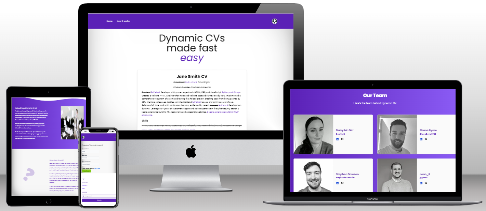

# Dynamic CV



Dynamic CV is a tool designed to help users create customized CVs tailored to specific job applications. It allows users to input their professional information and, by analyzing job titles provided for the given CV, suggests relevant skills and experiences to include. This streamlines the process of creating personalized CVs quickly, ensuring applicants highlight the most suitable qualifications for each role. Users can save multiple versions and download them as PDFs or Word documents, making it easier to adapt applications for different job opportunities.

Dynamic CV offers a smart analysis feature that not only checks for spelling errors but also identifies essential skills that may be missing from your CV. By evaluating the typical skill sets associated with your previous job titles, it intelligently suggests areas for enhancement, ensuring your resume highlights all relevant qualifications. This insight helps you align your profile with the key requirements of prospective roles, making your application more competitive and well-rounded.

For more details, visit [Dynamic CV](https://dynamic-cv.stephendawson.ie/).

## Features

- CV Creation
- Storing of multiple individual skills, education and work experience
- CV PDF download
- CV Preview
- Responsive Design
- CV Analysis & Tailored Feedback
- Contact Functionality
- Privacy Policy

## Deployment to Heroku

For Heroku deployment, you will need the following environment variables:

```
DATABASE_URL = <your-production-database-url>
SECRET_KEY = <your-secret-key>
CLOUDINARY_URL = <your-production-cloudinary-url>
ALLOWED_HOSTS = <your-deployed-app-url>
CSRF_TRUSTED_ORIGINS = <your-deployed-app-url>
DEBUG_MODE = False // Set to False in production, but can be True for debugging
OPENAI_API_KEY = API key for chat gpt for CV analysis

# Optional
DISABLE_COLLECTSTATIC = 1 // Set to 1 to disable collectstatic (don't make Cloudinary store all your CSS, JS and Image files)

```

## Developers

### Stephen Dawson

- [LinkedIn](https://github.com/stephendawsondev)
- [Github](https://github.com/stephendawsondev)

### Shane Byrne

- [LinkedIn](https://github.com/ShaneByrne0963)
- [Github](https://github.com/ShaneByrne0963)


### Joao Genari

- [LinkedIn](https://www.linkedin.com/in/jpgenari/)
- [Github](https://github.com/jpgenari)

### Daisy McGirr

- [LinkedIn](https://www.linkedin.com/in/daisy-mcgirr/)
- [Github](https://github.com/Dee-McG)